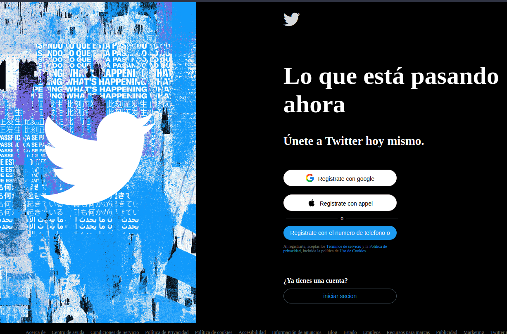
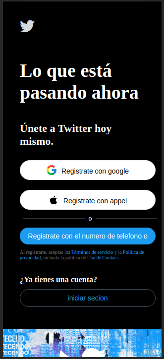

# Proyecto Clon del Frontend de Twitter

## Descripción

Este proyecto se centra en la creación de un clon del frontend de Twitter. El objetivo principal es replicar la pagina de inicio de sesión  característica de Twitter actualmente llamada X, utilizando HTML para la estructura y CSS para los estilos.

## Características Principales

- Diseño Responsivo: Adaptación del diseño para garantizar una experiencia de usuario consistente en una variedad de dispositivos.
- Estilos de Twitter: Aplicación de estilos que imitan la estética única de Twitter.

## Tecnologías Utilizadas

- HTML5: Utilizado para estructurar la página web y sus componentes.
- CSS3: Aplicado para estilizar y dar formato a los elementos de acuerdo con la interfaz de usuario de Twitter.

## Aprendizajes y Habilidades Adquiridas

Durante la realización de este proyecto, he obtenido conocimientos valiosos y he practicado varias habilidades esenciales, tales como:

1. **Maquetado Avanzado con HTML y CSS:** Reforcé mis habilidades en la creación de maquetas complejas y estructuras HTML/CSS más avanzadas.

2. **Interactividad con JavaScript (opcional):** Implementé funciones interactivas para simular la experiencia de navegación en Twitter.

3. **Diseño de Interfaz de Usuario:** Mejoré mi capacidad para diseñar interfaces de usuario atractivas y funcionales.

4. **Optimización para Móviles:** Aprendí técnicas para optimizar el diseño y la experiencia de usuario en dispositivos móviles.

## Capturas de Pantalla

*Interfaz de usuario del clon de Twitter escritorio.*

*Interfaz de usuario del clon de Twitter mobile.*

## Instalación

1. Clona el repositorio: `https://github.com/geoMerDev/clon-twitter`
2. Abre el archivo `index.html` en tu navegador.

